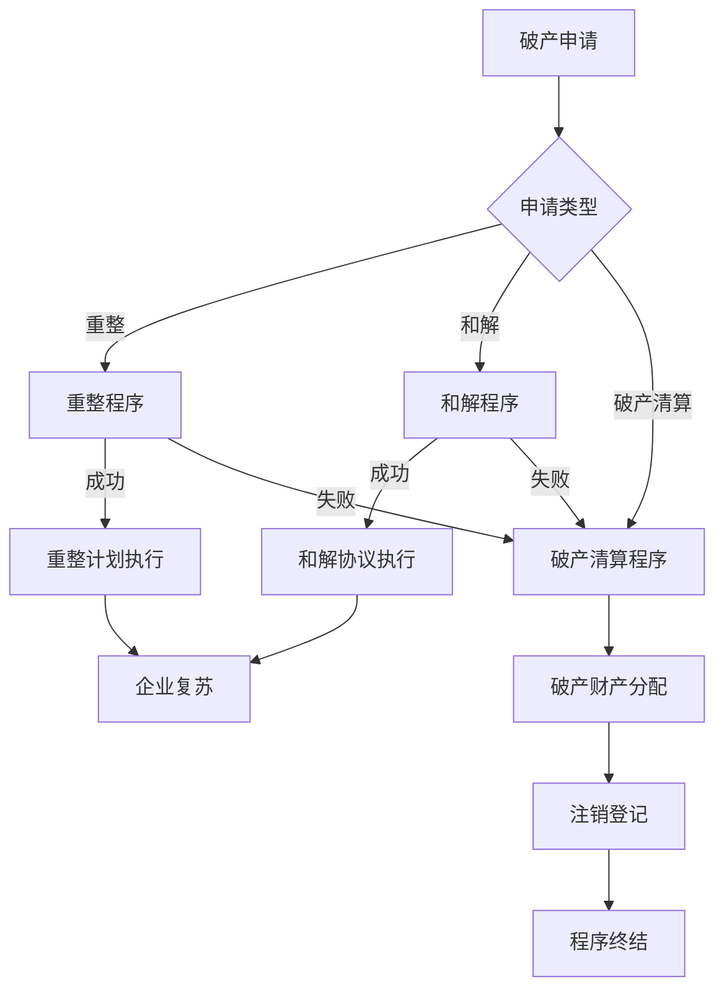

# 破产法律知识库

本知识库系统整理中国破产法律体系，为法律从业者、企业管理者、债权人及研究人员提供全面、准确的参考资料。

## 内容架构

| 模块 | 说明 | 入口 |
|------|------|------|
| **法律法规** | 《企业破产法》及相关法律法规 | [查看详情](01-fa-lv/index.md) |
| **司法解释** | 最高法关于破产法的司法解释 | [查看详情](03-si-fa-jie-shi/index.md) |
| **典型案例** | 最高法发布的破产指导案例和典型案例 | [查看详情](09-dian-xing-an-li/index.md) |
| **实务指南** | 破产程序各环节的操作指引 | [查看详情](10-shi-wu-zhi-nan/index.md) |

## 快速导航

| 模块 | 说明 | 文件数 |
|------|------|--------|
| [法律法规](01-fa-lv/index.md) | 《企业破产法》及相关法律 | 19 |
| [行政法规](02-xing-zheng-fa-gui/index.md) | 税务、工商、劳动等配套规定 | 9 |
| [司法解释](03-si-fa-jie-shi/index.md) | 最高法司法解释（一）（二）（三） | 32 |
| [最高法院司法文件](04-zui-gao-fa-yuan-si-fa-wen-jian/index.md) | 会议纪要、通知、意见与规定 | 18 |
| [部门规章](05-bu-men-gui-zhang/index.md) | 财政税务、金融监管、市场监管等 | 42 |
| [地方法规](06-di-fang-fa-gui/index.md) | 个人破产试点、府院联动等 | 8 |
| [地方法院指导意见](07-di-fang-fa-yuan-zhi-dao-yi-jian/index.md) | 各省市法院破产审判文件 | 42 |
| [破产管理人协会](08-po-chan-guan-li-ren-xie-hui/index.md) | 全国及地方管理人协会规范 | 4 |
| [典型案例](09-dian-xing-an-li/index.md) | 指导案例和典型案例 | 28 |
| [实务指南](10-shi-wu-zhi-nan/index.md) | 操作指引和实务要点 | 6 |
| [文书模板](11-wen-shu-mo-ban/index.md) | 常用法律文书模板 | 1 |
| [刑民交叉](12-xing-min-jiao-cha/index.md) | 破产与刑事程序交叉问题 | 14 |
| [专题研究](13-zhuan-ti-yan-jiu/index.md) | 涉税、跨境、房地产等专题 | 1 |
| [数据库资源](14-can-kao-zi-liao/index.md) | 官方数据库和专业平台 | 1 |

## 破产程序概览

## 核心法律文件

### 中华人民共和国企业破产法

[:octicons-arrow-right-24: 查看全文](01-fa-lv/qi-ye-po-chan-fa.md)

> 2006 年 8 月 27 日通过，2007 年 6 月 1 日起施行。共十二章一百三十六条，涵盖总则、申请和受理、管理人、债务人财产、破产费用和共益债务、债权申报、债权人会议、重整、和解、破产清算、法律责任、附则等内容。

## 最新更新

| 日期 | 更新内容 |
|------|----------|
| 2025-06-21 | 全面更新知识库结构，优化模块设计 |
| 2025-01-01 | 知识库初始化，完成《企业破产法》全文录入 |

## 免责声明

本知识库内容仅供参考学习之用，不构成法律意见。具体法律问题请咨询专业律师。

---

*最后更新：2025 年 6 月 21 日*
